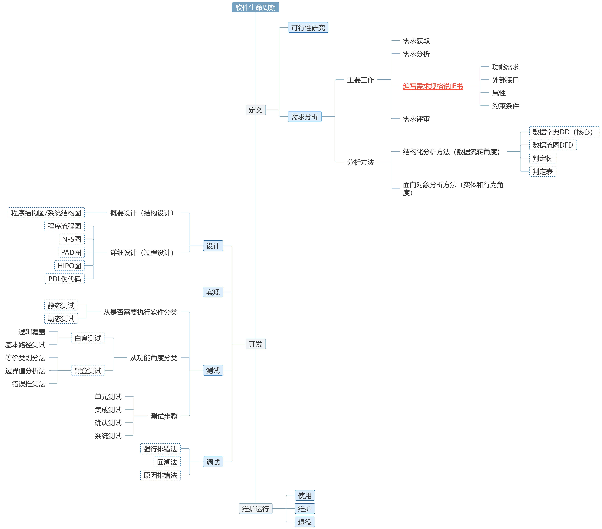

# 软件工程基础
## 软件
### 软件的定义
包含两部分
- 机器**可**执行的：**程序、数据**
- 机器**不可**执行的：与开发运行维护使用有关的**文档**
### 软件的特点
- 是**逻辑实体**，具有抽象性
- **没有**明显的制作过程
- **不存在磨损、老化**问题
- 对计算机系统具有依赖性
- 复杂性高，成本**昂贵**
- 软件开发涉及诸多社会因素
### 软件危机
落后的软件生产方式无法满足迅速增长的计算机软件需求，从而导致软件开发和维护过程中出现的一系列**无法控制的严重问题**的现象
- 开发生产率低
- 质量难以控制
- 成本不断提高
### 软件工程
为了**解决软件危机**提出的概念，是应用于软件的定义、开发、维护的过程

**三要素：**
- **方**法：完成软件工程项目的**技术手段**
- **工**具：用来支持软件开发、管理、文档生成
- **过**程：用来支持软件开发的各个环节控制、管理
### 软件过程
把输入转化为输出的一组彼此相关的资源和活动。
**四大基本活动：**
- 软件规格说明（**plan**）：规定软件的功能和运行时限制
- 软件开发或软件设计与实现（**do**）
- 软件确认（**check**）：确认软件能够满足客户提出的要求
- 软件演进（**act**）：为了满足客户变更要求，在使用过程中不断的演进
### 软件生命周期
软件产品的提出→实现→使用维护→停止使用的过程

三阶段：⭐**①定义**→**②开发**→**③维护运行**
- 软件**定义**
  - 可行性研究
  - **需求分析⭐**
- 软件**开发**
  - **设计⭐**
  - 实现
  - 测试
- 软件**维护运行**
  - 使用
  - 维护
  - 退役

## 软件定义-需求分析
让软件系统确定要 **“做什么”**

### 主要工作
1. 需求获取
2. 需求分析
3. 编写⭐**需求规格说明书**⭐：
    - **作用**：
      - 便于用户、开发人员进行理解和交流
      - 作为**软件开发工作的基础和依据**
      - 软件**确认测试**和验收的标准
      - 是需求分析**阶段的最后成果**
    - **内容**：
       - **功能需求**：软件需要完成的具体任务。
       - **外部接口**：系统与用户、其他软件或硬件的交互方式。
       - **属性（功能与性能）**：软件的性能、安全性、可维护性等。
       - **约束条件（运行环境）**：操作系统、硬件需求等
4. 需求评审
### 分析方法
1. **结构化分析方法**：使用数据流图（DFD）、数据字典（DD）等工具，从**数据流转**的角度分析需求。
2. **面向对象的分析方法**：基于对象和类，强调系统的**实体和行为**。
### 常用工具
**结构化分析**的常用工具：两数据两判定
1. **数据字典（DD，结构化分析方法的核心⭐）**：记录和定义所有数据项、数据结构及其关系，帮助开发人员理解数据含义。
2. **数据流图（DFD，支持系统的功能建模）**：用图形表示**数据**在系统中的流动情况，描述数据的输入、处理和输出。箭头表示**数据流**。
     - 数据存储间不应有数据流
     - 每个数据流应有名字（除了流入或流出数据存储的）
     - 相邻两层间具有父子关系
     - 子图个数不大于父图的处理个数
     - 子图输入输出应与父图中相应处理的输入输出一致
  - 
3. **判定树**：用树形结构描述决策逻辑，每个分支代表不同条件下的决策路径。
4. **判定表**：用表格形式列出各种输入条件及其对应的输出结果，适合处理复杂逻辑判断。
## 软件开发-设计
让软件系统确定要 **“怎样做”**
### 结构化软件设计四大基本原理
1. **抽象**
2. **模块化**
3. **信息隐蔽**：模块内部数据不可被外部直接访问。
4. **模块的独立性**：**高内聚、低耦合**
### 1.概要设计（结构设计/总体设计）
**目标**：
- 设计软件系统结构、数据接口及数据库
- 编写概要设计文档（概要设计说明书、数据库设计说明书、集成测试计划）
- 评审

**常用工具：** **结构图**⭐（程序结构图/系统结构图）层次结构
- **上级模块** → 调用下级模块
- **从属模块** → 被上级模块调用
- **扇入数** → 被上级模块调用的次数
- **扇出数** → 直接调用其他模块的次数
- **深度** → 结构图的层数
- **宽度** → 每层的最大模块数
- **原子模块** → 叶子节点，无法再被分解
### 2.详细设计（过程设计）
为每一个模块确定实现**算法**、**接口**和**局部数据结构**

**常用工具：**
- **图形工具：** 
  1. 程序**流程图**：
    - 椭圆形：起止
    - 平行四边形：输入输出
    - 矩形：处理
    - 菱形：判断
    - 箭头：⭐**控制流**
  2. **N-S图**：**方框**嵌套结构表示流程，避免交叉线
    - 
  3. **PAD图**：用图示方法表达程序流程，特别适用于大规模系统。
    - 
  4. **HIPO图**：分层表示程序结构，并描述输入、处理和输出。
    - 
- **表格工具：** 判定表
- **语言工具：** PDL（伪代码）
## 软件开发-测试
### 目的
- **尽可能多地发现**程序中的错误 **（不负责修改⭐）**，贯穿整个软件生命周期
- 一个好的测试用例（输入数据和预计输出结果）：可能找到迄今为止尚未发现的错误的用例
- 一个成功的测试：发现至今尚未发现的错误的测试
### 准则
- 所有测试都应追溯到需求
- 严格执行测试计划，排除测试的随意性
- 充分注意测试中的群集现象
- 程序员应避免检查自己的程序
- 穷举测试不可能
- 妥善保存测试计划、测试用例、出错统计和最终分析报告
### 方法
从**是否需要执行软件**的角度：
1. **静态测试**：不实际运行软件
2. **动态测试**：运行软件

从**功能**的角度：
- **白**盒测试（结构测试/逻辑驱动测试）：将程序看作是**路径的集合**，关注程序内部逻辑，测试代码覆盖率。
  - 逻辑**覆**盖：确保不同分支路径均被执行。
  - **基**本路径测试：检查独立的路径集合，确保每条路径至少执行一次。
- **黑**盒测试（功能测试/数据驱动测试）：关注输入输出，不考虑代码内部逻辑。
  - **等**价类划分法：将输入分成不同类别，每类选一个代表值进行测试。
  - **边**界值分析法：测试输入的边界值（如最大、最小、空值等）。
  - **错**误推测法：基于经验，推测可能出现的错误点进行测试。
### 步骤
1. **单元测试**：测试**最小功能单元**（函数、类）。(依赖编码和详细设计说明书)
2. **集成测试**：测试模块之间的**交互**。（依赖总体设计说明书）
   1. 非增量方式组装（一次性组装）
   2. 自顶向下增量组装
   3. 自底向上增量组装
3. **确认测试⭐**：检查软件是否**满足需求**。（依赖需求规格说明书）
4. **系统测试**：在**真实环境**中运行，测试整体功能。
## 软件开发-调试
**诊断**和**改正**程序中的错误，主要在**开发阶段**
### 步骤
1. 错误定位：找出错误代码的位置。
2. 修改：修正错误代码。
3. 回归测试：验证修改是否引入新问题。
### 方法
1. 强行排错法：插入调试信息（如print语句）检查变量值。
2. 回溯法：从错误发生点逆向查找错误原因。
3. 原因排错法：列出可能原因，逐个排查，找出错误来源。